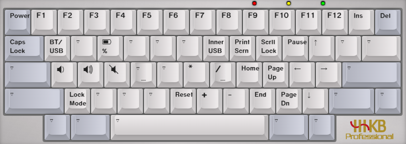
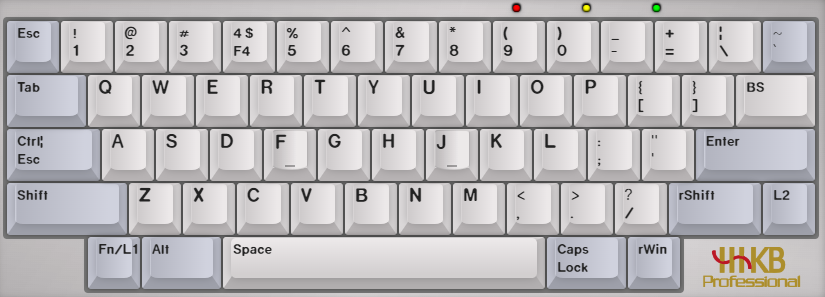
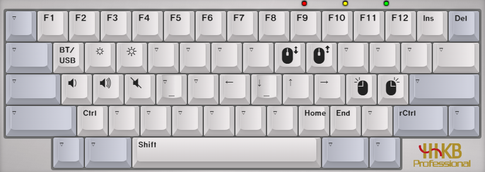
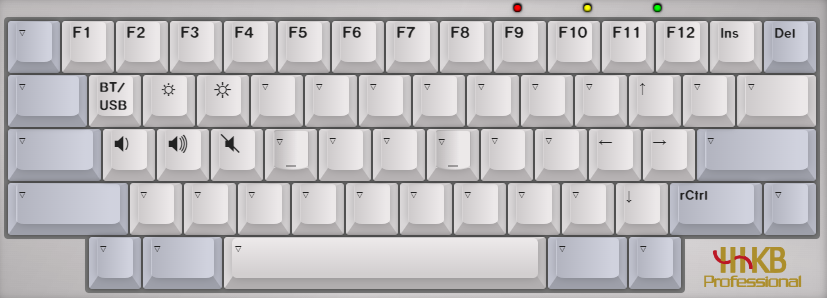

## 快捷键
重启键盘 `LShift` + `RShift` + `b`  
清除蓝牙设备信息 `LShift` + `RShift` + `LCtrl` + `r`  
蓝牙设置为可发现 `LShift` + `RShift` + `i`  
蓝牙设置为不可发现 `LShift` + `RShift` + `o`  

## 改键
Keymap Builder for HHKB BLE [ydkb.io](https://ydkb.io/)  
选择要设置的键盘, 搜索 HHKB BLE  
设置 key map, `下载/分享` ==> 下载 .bin 固件

- 有线模式
- 同时按 左右 Shift + B 重启键盘,立即按住 Esc 不放,进入刷机模式
- 电脑会识别出一个名为 HHKB_BLE 的磁盘
- 进入 HHKB_BLE 磁盘, 替换 HHKB_BLE.BIN
- 右键弹出该磁盘或再按一次 Esc 退出(有时刷完是自动退出), 刷机完成

---

已生成的固件
- **bin/00/HHKB_BLE.BIN**  
    (default)  
    layer 0  
      
    layer 1  
      
- **bin/01/HHKB_BLE.BIN**  
	layer 0  
	  
	layer 1  
	  
	layer 2  
	  