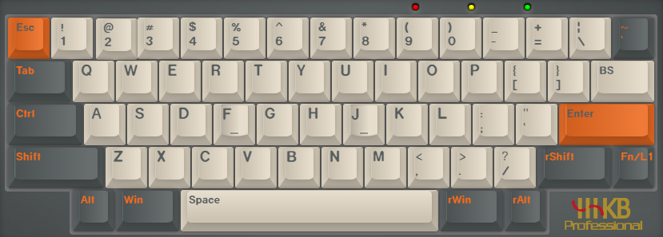

Keymap Builder for HHKB BLE [ydkb.io](https://ydkb.io/)

- 有线模式
- 同时按 左右 Shift + B 重启键盘,立即按住 Esc 不放,进入刷机模式
- 电脑会识别出一个名为 HHKB_BLE 的磁盘
- 进入 HHKB_BLE 磁盘, 替换 HHKB_BLE.BIN

---

已生成的固件
- **bin/00/HHKB_BLE.BIN**  
(default)  
layer 0  
  
layer 1  
  
- **bin/01/HHKB_BLE.BIN**  
layer 0  
  
layer 1  
  